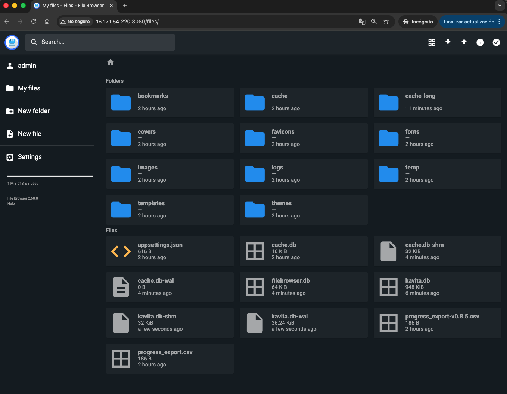

# Kavita Cloud Vault 📚☁️

This project is a custom fork designed to host a private, persistent manga and ebook library on **AWS ECS Fargate**. It utilizes **Amazon EFS** to ensure your books and configurations survive even if the containers are restarted or destroyed.

---

## 🏗️ Architecture

The infrastructure deploys two synchronized services sharing a single persistent volume via **Amazon EFS**:

* **FileBrowser (Port 8080):** Your gateway for file management. Upload, delete, or organize your library files here.
* **Kavita (Port 5000):** The ultimate reading suite. It indexes the files uploaded via FileBrowser and provides a high-quality reading interface.


---

## 🚀 Deployment

### Prerequisites
* **AWS CLI** installed and configured.
* **Terraform 1.0+** installed.

### Setup
1.  **Clone and Init:**
    ```bash
    git clone https://github.com/MisaelTox/kavita-cloud-vault.git
    cd kavita-cloud-vault
    terraform init
    ```
2.  **Apply Infrastructure:**
    ```bash
    terraform apply
    ```
3.  **Network Configuration:**
    Ensure the public subnet is associated with a **Route Table** that has a route to `0.0.0.0/0` via an **Internet Gateway (IGW)** to allow external access.

---

## 📸 Screenshots & Usage Guide

### 📂 Phase 1: Uploading (FileBrowser)
Access the management UI at `http://<TASK_PUBLIC_IP>:8080`.



* **Default Login:** `admin` / `admin` (Please change this in Settings immediately).
* **Workflow:** Files uploaded here are physically stored on the EFS volume under the `/srv` path.

### 📖 Phase 2: Reading (Kavita)
Access the reader UI at `http://<TASK_PUBLIC_IP>:5000`.


* **Setup:** Create your admin account on the first run.
* **Library Path:** When adding a library, use the internal path: `/data`.
* **Sync:** After uploading new files via FileBrowser, trigger a **Library Scan** in Kavita to update your collection.


---

## 🛠️ Custom Modifications (Fork Features)

* **Persistence:** Integrated **Amazon EFS** for both `/config` (database) and `/data` (media).
* **Resource Tuning:** Optimized CPU and Memory units for cost-effective Fargate performance.
* **Security Groups:** Pre-configured rules for ports `5000` and `8080`.

---

## 💰 Cost Optimization

To save money when you are not reading, scale the service to zero. Your files in EFS will be preserved:

```bash
# Stop the server (Save money)
aws ecs update-service --cluster kavita-cluster --service kavita-service --desired-count 0

# Start the server (Resume reading)
aws ecs update-service --cluster kavita-cluster --service kavita-service --desired-count 1

```
---

## 🤝 Acknowledgments & Credits

This project is a **custom fork** built upon the work of the original creators. 

* **Kavita:** Thanks to the [Kavita team](https://www.kavitareader.com/) for their amazing open-source e-reader.
* **FileBrowser:** Thanks to the [FileBrowser project](https://filebrowser.org/) for the powerful file management tool.

### 🛠️ Fork Enhancements by MisaelTox:
- Implementation of **Amazon EFS** for full data persistence.
- Unified storage bridge between FileBrowser and Kavita.
- Automated security group and networking reliability fixes.

---

## 📜 License
This project is licensed under the same terms as the original repository. Please check the original license file for more details.
