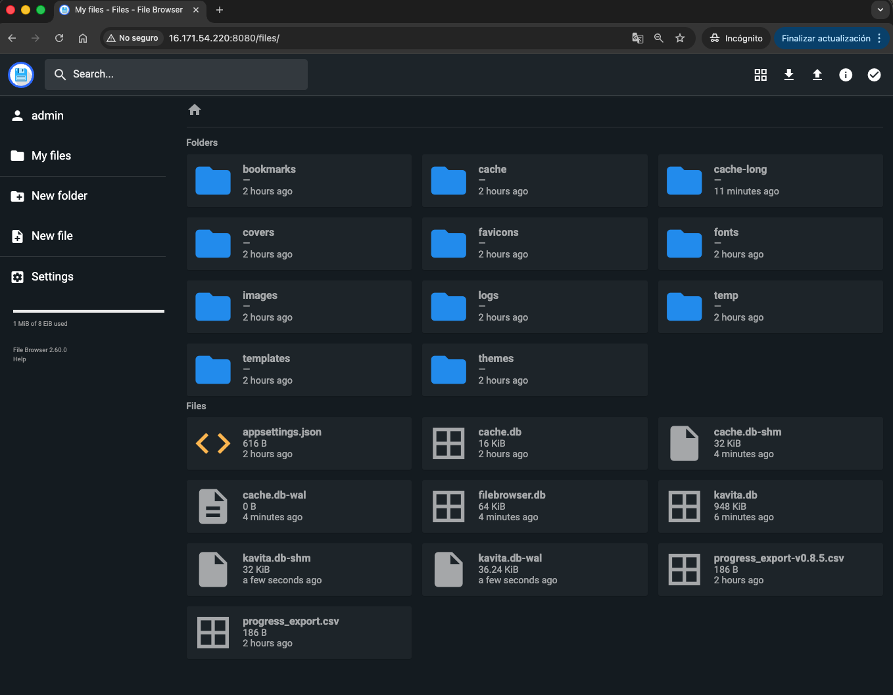
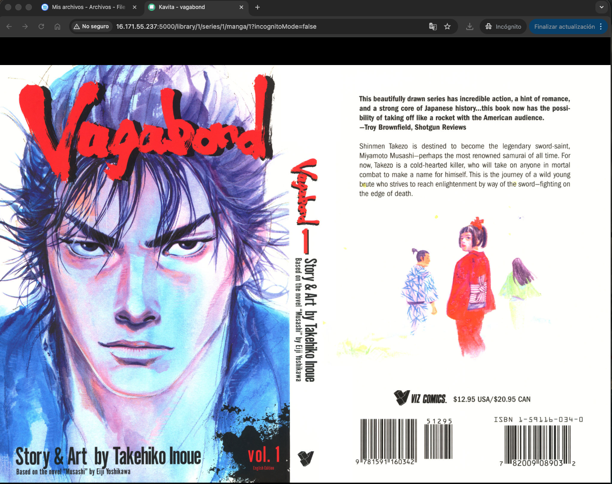

# Kavita Cloud Vault 📚☁️


AWS Cloud Infrastructure for a private, persistent manga and ebook library on **AWS ECS Fargate**, with automated CI/CD via **GitHub Actions**.

---

## 🏗️ Architecture

| Component | Technology |
|-----------|-----------|
| Compute | AWS ECS Fargate (2 services) |
| Storage | Amazon EFS (shared `/config` + `/data`) |
| File Management | FileBrowser (Port 8080) |
| Reader | Kavita (Port 5000) |
| IaC | Terraform |
| CI/CD | GitHub Actions |

---

## 🔄 CI/CD Pipeline
```
Push to main
      ↓
✅ terraform fmt     → format validation
✅ terraform validate → syntax check
✅ terraform plan    → AWS impact preview
      ↓
⏸️  Manual approval gate (production environment)
      ↓
🚀  terraform apply  → deploy to AWS
```

AWS credentials stored as **GitHub Secrets** — never hardcoded.

---

## 📸 Screenshots

### 📂 FileBrowser — File Management (`http://<IP>:8080`)
[](img/filekavita.png)

### 📖 Kavita — Reading Interface (`http://<IP>:5000`)
[](img/mangakavita.png)

---

## 🚀 Deployment
```bash
git clone https://github.com/MisaelTox/kavita-cloud-vault.git
cd kavita-cloud-vault/terraform
terraform init
terraform apply
```

**Library Path in Kavita:** `/data`
**FileBrowser default login:** `admin` / `admin` *(change immediately)*

---

## 💰 Cost Control

Scale to zero when not reading — EFS preserves all your files:
```bash
# Stop (save money)
aws ecs update-service --cluster kavita-cluster --service kavita-service --desired-count 0

# Resume
aws ecs update-service --cluster kavita-cluster --service kavita-service --desired-count 1
```

---

## 📝 Lessons Learned

- **CI/CD with GitHub Actions** — automated Terraform validation pipeline with manual approval gate for production deploys
- **Shared EFS volumes** — bridged two containers (FileBrowser + Kavita) via a single EFS mount for unified storage
- **Multi-service ECS** — managed two Fargate tasks sharing the same VPC and security groups
- **Cost optimization** — implemented scale-to-zero pattern to avoid charges when idle

---

## 🤝 Credits

- [Kavita](https://www.kavitareader.com/) — open-source manga/ebook reader
- [FileBrowser](https://filebrowser.org/) — web-based file manager