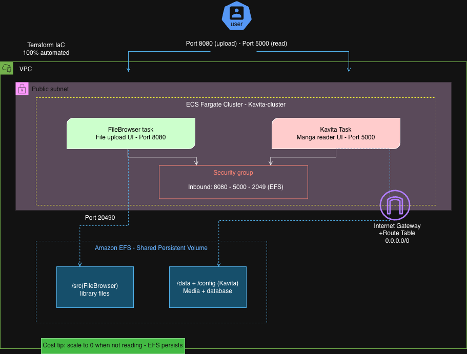
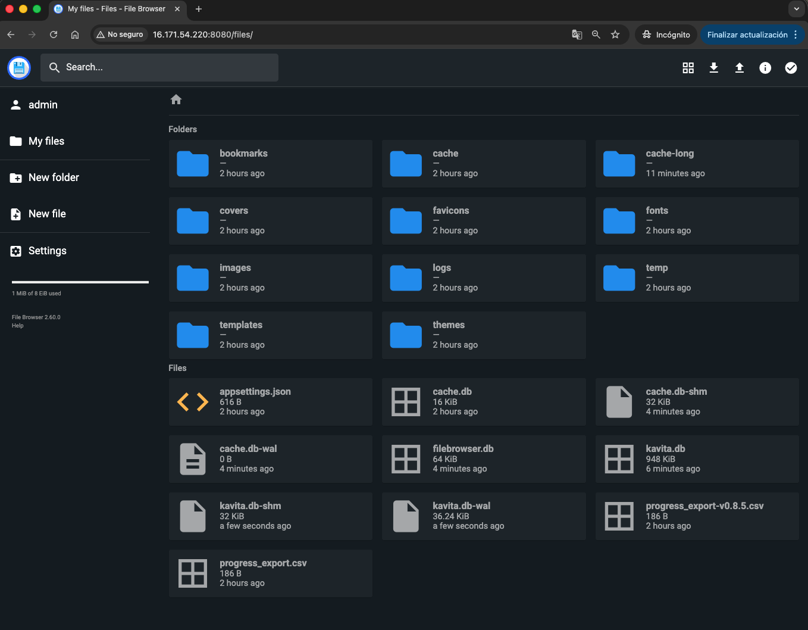
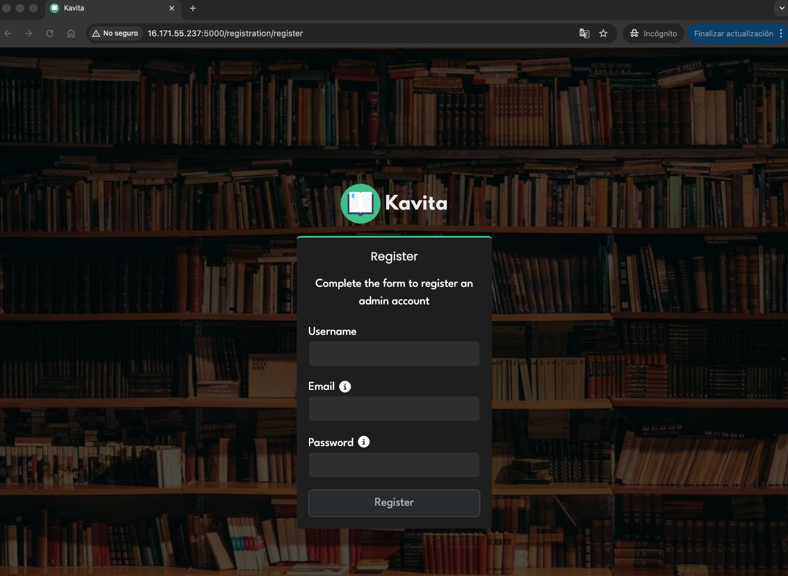

# Kavita Cloud Vault 📚☁️


Cloud infrastructure that hosts a private, persistent manga and ebook library on **AWS ECS Fargate**. The entire stack — networking, storage, compute, IAM, and CI/CD — is defined in Terraform and can be destroyed and recreated from code alone. **Amazon EFS** keeps your books and configuration intact even when containers are restarted or replaced.

---

## 🏗️ Architecture

The infrastructure deploys two containers in a single Fargate task, sharing one persistent volume via **Amazon EFS**:

* **FileBrowser (Port 8080):** Your gateway for file management. Upload, delete, or organize your library files here.
* **Kavita (Port 5000):** The reading suite. It indexes the files uploaded via FileBrowser and provides a high-quality reading interface.

### Architecture Diagram



### AWS Resources

| Layer | Resources |
|---|---|
| Networking | VPC, public subnet, Internet Gateway, route table |
| Storage | EFS file system (encrypted at rest) + mount target |
| Compute | ECS Fargate cluster, task definition (2 containers), service |
| Security | Two security groups — web access and EFS (port 2049, SG-to-SG only) |
| Observability | CloudWatch log group (7-day retention) |
| IAM | ECS task execution role with the AWS-managed policy |

---

## 🚀 Deployment

### Prerequisites

* **AWS CLI** installed and configured.
* **Terraform 1.7+** installed.

### Setup

1. **Clone and init:**

   ```bash
   git clone https://github.com/MisaelTox/kavita-cloud-vault.git
   cd kavita-cloud-vault/terraform
   terraform init
   ```

2. **Apply the infrastructure** — `admin_cidr` restricts who can reach the FileBrowser admin UI, so pass your own IP:

   ```bash
   terraform apply -var="admin_cidr=$(curl -s ifconfig.me)/32"
   ```

### CI/CD

Every push and pull request runs `fmt`, `init` and `validate` — no AWS credentials required, so the pipeline stays green without touching live infrastructure. Deploys are triggered manually from the Actions tab (`workflow_dispatch`) and go through the `production` environment approval gate before `terraform apply` runs.

---

## 🔒 Security Notes

* **FileBrowser (8080)** is restricted to `admin_cidr` and requires a login — it can write to every file in the library, so it is never exposed publicly.
* **Kavita (5000)** is reachable from anywhere, protected by its own user account.
* **EFS** is encrypted at rest and only accepts NFS traffic from the web security group, never from the internet.

---

## 📸 Screenshots & Usage Guide

### 📂 Phase 1: Uploading (FileBrowser)

Access the management UI at `http://<TASK_PUBLIC_IP>:8080`.



* **Default Login:** `admin` / `admin` (Please change this in Settings immediately).
* **Workflow:** Files uploaded here are physically stored on the EFS volume under the `/srv` path.

### 📖 Phase 2: Reading (Kavita)

Access the reader UI at `http://<TASK_PUBLIC_IP>:5000`.



* **Setup:** Create your admin account on the first run.
* **Library Path:** When adding a library, use the internal path: `/data`.
* **Sync:** After uploading new files via FileBrowser, trigger a **Library Scan** in Kavita to update your collection.


---

## 🧠 Engineering Highlights

* **Persistence on ephemeral compute:** Fargate tasks are disposable, so both `/config` (database) and `/data` (media) live on EFS — the library survives any container replacement.
* **Unified storage bridge:** a single EFS volume mounted into two containers at different paths, letting FileBrowser write what Kavita reads.
* **Least-privilege networking:** EFS accepts NFS traffic only from the web security group, and the admin UI is limited to a single CIDR.
* **Credential-free CI:** validation runs on every push without AWS keys; deploys are manual and gated.

---

## 💰 Cost Optimization

To save money when you are not reading, scale the service to zero. Your files in EFS will be preserved:

```bash
# Stop the server (save money)
aws ecs update-service --cluster kavita-cluster --service kavita-service --desired-count 0

# Start the server (resume reading)
aws ecs update-service --cluster kavita-cluster --service kavita-service --desired-count 1
```

---

## 🤝 Acknowledgments & Credits

The infrastructure in this repository is my own work. The applications it deploys are excellent open-source projects, used here as official Docker images:

* **Kavita:** Thanks to the [Kavita team](https://www.kavitareader.com/) for their open-source e-reader.
* **FileBrowser:** Thanks to the [FileBrowser project](https://filebrowser.org/) for the powerful file management tool.

---

*Infrastructure & DevOps by [Misael Tóxcatl (Tox)](https://github.com/MisaelTox)*
